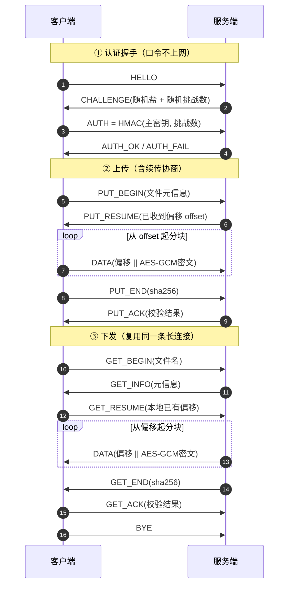

# 基于 Socket 的局域网文件加密传输系统（v2 重构版）

> 一句话定位：**在不可信的局域网里，用一条长连接把文件加密、带完整性校验、可断点续传地传过去——而且口令从不经过网络。**

本项目是大学课程设计《基于 Socket 的局域网文件加密传输系统》的工程化重构。原版是一个把加密、协议、界面、传输逻辑全挤在单文件里的脚本（`aes_crypto.py` + `server.py` + `client.py` + tkinter），虽能跑，但存在硬编码密钥、MD5 校验、整文件读内存、口令明文过网等典型缺陷。重构后拆成清晰的分层架构，并补齐了断点续传与自动化测试。

---

## 一、改进对照表

| 维度 | 原课设版 | 重构后 |
|------|----------|--------|
| 对称加密 | AES-128-CBC + PKCS7 | **AES-256-GCM**（AEAD 认证加密，篡改即报错） |
| 完整性校验 | MD5 | **SHA-256**（整文件二次确认 + 每块 GCM 标签） |
| 密钥管理 | 硬编码 `b'1234567890abcdef'` | **PBKDF2-HMAC-SHA256** 20 万次迭代 + 随机盐派生，**密钥不落源码** |
| 身份认证 | 口令明文过网 | **HMAC-SHA256 挑战应答**：口令从不上网，每次会话盐/挑战数不同，抗重放 |
| 断点续传 | 无（断线从头重传） | 分块续传（`.part` + 元数据），可恢复任意中断 |
| 大文件 | 整文件 `f.read()` 进内存 | **64 KiB 流式滑动窗口**，内存占用恒定 |
| 代码结构 | 单文件脚本 | 分层架构（config / crypto / protocol / resume_store / transfer / session） |
| 自动化测试 | 无 | **pytest** 测试套件 + 端到端冒烟脚本 |

---

## 二、目录结构

```
secure_file_transfer/
├── app/                     # 核心层（可单测，无 I/O 副作用）
│   ├── __init__.py         # 版本与模块说明
│   ├── config.py           # 集中配置：ServerConfig / ClientConfig（密钥不落源码）
│   ├── crypto.py           # 纯函数加密层：AES-256-GCM / SHA-256 / PBKDF2 / HMAC
│   ├── protocol.py         # 自定义二进制协议：12 字节帧头编解码、消息类型
│   ├── resume_store.py     # 断点续传存储：.part + .part.meta.json
│   ├── transfer.py         # 分块传输调度：发送端 / 接收端
│   └── session.py          # 会话层：认证握手 + 上传/下发四个过程
├── cli_server.py           # 命令行服务端入口（多线程、logging、进度节流）
├── cli_client.py           # 命令行客户端入口（upload/download/shell 子命令）
├── smoke_e2e.py            # 端到端冒烟脚本（认证→上传→下发→错误口令）
├── tests/                  # pytest 测试套件
├── requirements.txt        # pycryptodome / pytest / pytest-cov
├── Dockerfile              # 容器化（python:3.13-slim，非 root 用户）
├── docker-compose.yml      # 单服务编排，密码从环境变量注入
├── .dockerignore / .gitignore
└── README.md
```

---

## 三、运行环境

本项目用到的 `tkinter` 在部分 Python 发行版里不是默认自带的。本机实测：
- 托管 Python 3.13 → **没有** `tkinter`（`ModuleNotFoundError: No module named 'tkinter'`），图形界面跑不起来
- 系统 `C:\Python310` → 自带 `tkinter 8.6` + `pycryptodome 3.23.0`

因此**请用带 tkinter 的解释器建虚拟环境**，例如 Windows 下：
```bat
C:\Python310\python.exe -m venv .venv
.venv\Scripts\python.exe -m pip install -r requirements.txt
```
Linux 若缺 tkinter：`sudo apt install python3-tk`（Debian/Ubuntu）。

---

## 四、快速开始

### 本地（服务端 / 客户端）

```bash
# 1) 安装依赖
pip install -r requirements.txt

# 2) 启动服务端（口令建议用环境变量，避免出现在命令行历史）
export SFT_PASSWORD=demo123
python cli_server.py --host 127.0.0.1 --port 5001 --data-dir ./data

# 3) 客户端上传
python cli_client.py --host 127.0.0.1 --port 5001 upload ./somefile.bin

# 4) 客户端下发（远端文件需已知文件名）
python cli_client.py --host 127.0.0.1 --port 5001 download somefile.bin

# 5) 交互式
python cli_client.py --host 127.0.0.1 --port 5001 shell
#   sft> put ./a.txt
#   sft> get b.txt
#   sft> ls          # 仅列出本地下载目录（远端无列目录接口）
#   sft> quit
```

> **口令来源顺序**
> - 客户端：`--password` > 环境变量 `SFT_PASSWORD` > `getpass` 交互输入（绝不回退到默认口令）。
> - 服务端：`--password` > 环境变量 `SFT_PASSWORD` > 演示默认口令 `123456`（使用时启动日志会打印 WARNING）。

### Docker 方式

```bash
export SFT_PASSWORD=demo123
docker compose up --build
# 客户端照常：python cli_client.py --host <容器IP> --port 5001 upload xxx
```

---

## 五、自动化验证

四个可复跑的验证脚本都在项目根目录，统一用 `.venv` 的解释器运行：

| 脚本 | 验证什么 | 成功标志 |
|------|----------|----------|
| `verify_cli_e2e.py` | 拉起真实 `cli_server.py` 子进程，用真实 `cli_client.py` 跑：上传/下载各 2 个文件（含跨块与 1 块+7 字节边界）逐字节比对、退出码、错误口令拒绝、拒绝后服务端仍可用、shell 会话内长连接复用、接收目录无 `.part` 残骸 | `CLI_E2E_OK` |
| `verify_resume.py` | **断点续传是真的**：手工伪造"3 块里已收 1 块"的现场，中间挂 TCP 代理独立统计线上字节数，证明只传了 2/3 而非重传 | `RESUME CHECK PASSED` |
| `verify_gui_engine.py` | 图形界面的 Engine 层（不依赖窗口）在回环上跑完整上传+下载 | `GUI_ENGINE_E2E_OK` |
| `verify_conn_governance.py` | **连接治理真的生效**：用 `--max-clients 1 --conn-timeout 3` 起服务端，验证第 2 个连接被拒绝、空闲连接被回收、名额回收后新连接可用、日志留下 WARNING | `CONN_GOVERNANCE_OK` |

实测数据（`verify_resume.py`，3×64 KiB 文件）：整文件传输需 **196752 字节**，续传实测线上仅 **131640 字节**，服务端协商偏移正好 **65536**。

---

## 六、协议说明

### 6.1 帧结构（12 字节定长头）

```
┌────────┬───────┬──────┬──────────┬──────────────┐
│ MAGIC  │  VER  │ TYPE │  SEQ     │  PAYLOAD_LEN │
│ 2 字节  │ 1 字节 │1 字节│  4 字节   │   4 字节      │
└────────┴───────┴──────┴──────────┴──────────────┘
        ">2sBBII"（大端），魔数 0xF71A，版本 2
```

`recv_frame` 内部循环读满定长头 + 载荷，一次性解决 TCP 粘包/半包。单帧载荷上限 16 MiB，防止脏长度导致无限 `recv`（DoS）。`DATA` 帧载荷为 `8 字节偏移 || GCM密文`，偏移量写入 GCM 的 AAD，攻击者改偏移会让解密失败。

### 6.2 消息类型

| 阶段 | 类型 | 值 | 方向 / 含义 |
|------|------|----|------------|
| 认证 | HELLO | 0x01 | C→S 请求握手 |
| 认证 | CHALLENGE | 0x02 | S→C 下发盐 + 随机挑战数 |
| 认证 | AUTH | 0x03 | C→S HMAC(主密钥, 挑战数) |
| 认证 | AUTH_OK | 0x04 | S→C 认证通过 |
| 认证 | AUTH_FAIL | 0x05 | S→C 认证失败 |
| 上传 | PUT_BEGIN | 0x10 | C→S 声明上传（含文件元信息） |
| 上传 | PUT_RESUME | 0x11 | S→C 告知已收到偏移（续传核心） |
| 传输 | DATA | 0x12 | 双向 加密分块 |
| 上传 | PUT_END | 0x13 | C→S 上传结束 |
| 上传 | PUT_ACK | 0x14 | S→C 上传结果 |
| 下发 | GET_BEGIN | 0x20 | C→S 请求下发 |
| 下发 | GET_INFO | 0x21 | S→C 文件元信息 |
| 下发 | GET_END | 0x22 | S→C 下发结束 |
| 下发 | GET_ACK | 0x23 | C→S 接收结果 |
| 下发 | GET_RESUME | 0x24 | C→S 告知本地已有偏移 |
| 控制 | ERROR | 0xEE | 双向 错误 |
| 控制 | BYE | 0xFF | 双向 正常关闭 |

---

## 七、断点续传原理

接收端不直接写目标文件，而是写 `<文件名>.<file_id前8位>.part`，并在同名的 `.part.meta.json` 里记录 `file_id / size / sha256 / chunk_size / 已落盘块的起始偏移列表`。

重连后把元数据读回，算出**下一次该从哪个偏移开始传**，只请求缺失部分；全部到齐后校验整文件 SHA-256，通过才 `os.replace` 原子重命名为正式文件。

**关键点：`next_offset` 采用"连续前缀"语义。** 它返回的是「从 0 开始连续收到的最大长度」，而不是最大偏移。如果网络乱序或丢块导致中间出现空洞，空洞之后的数据即使到了也不能算作"已收到"——否则文件会在空洞处静默损坏。续传时只从连续前缀之后开始补传。

---

## 八、安全说明

本系统适合**局域网 / 可信内网**场景下的教学与演示。以下为明确的**教学简化**，生产环境不应直接照搬：

- **口令即共享密钥**：双方用同一口令派生的主密钥，没有非对称密钥交换（如 ECDH），无法做到前向保密，也不支持多用户各自的凭据。
- **无传输层加密（TLS）**：加密只在应用层（AES-256-GCM），TCP 本身明文。跨不可信网络应套一层 TLS 或 VPN。
- **无权限模型**：共享目录按文件名取用，任何知道文件名且口令正确的客户端都能下载任意共享文件。
- **默认口令 `123456`**：仅作演示兜底（常量 `config.DEMO_PASSWORD`）。服务端仍在使用它时会在启动日志打印 **WARNING** 提醒覆盖。注意这是**口令**不是密钥——真正的 AES-256 密钥每次会话都用 PBKDF2-HMAC-SHA256（200000 次迭代）现场派生，源码中不存在任何硬编码密钥。

### 基础连接治理

服务端对连接做了两道防护，抵御最简单的资源耗尽：

| 项 | 默认 | 配置方式 |
|---|---|---|
| 单连接空闲超时 | 300 秒（0 = 不限制） | `--conn-timeout` / `SFT_CONN_TIMEOUT` |
| 同时在线连接数上限 | 64 | `--max-clients` / `SFT_MAX_CLIENTS` |

超限的新连接被直接拒绝并记日志；半开连接（连上不发数据）在超时后被回收，不会长期占用线程。这是**教学级简化**——生产环境还需要按 IP 限流、指数退避与告警。

### 容错设计约定

**收尾失败也必须回执**。`handle_upload` / `request_download` 在做"校验+转正+清理元数据"时如果抛异常，服务端**仍然要发 `PUT_ACK`、客户端仍然要发 `GET_ACK`**，把真实原因写进 `message` 字段。否则对端会一直阻塞在等回执，最后报出一个和真实原因无关的"对端连接已断开"，排查成本极高。元数据清理（`ResumeStore.cleanup_meta`）被定义为**尽力而为**：删不掉只是丢失下一次续传的复用能力，绝不能把一次已经成功的传输判定为失败。

### 内容寻址幂等（并发安全）

`file_id` 本身就是**内容的 SHA-256**，因此"同名 + 同大小 + 同 SHA-256"等价于"这份内容已经在服务端就位"。据此 `handle_upload` 在协商阶段做一次短路：

- **重复投递**同一个文件（脚本重跑、手抖点两次上传）→ 服务端直接让客户端从 `offset == size` 开始，**一个字节都不用传**，返回 `skipped: true`。
- **多个客户端并发上传同一内容** → 同一目标路径的会话被串行化（按 `.part` 路径取可重入锁），先到者落盘，后到者幂等短路或在校验后确认内容一致，**全部返回成功**而不是让输家报错。

> 为什么需要锁：Windows 下 `os.replace` 要求源文件**无任何其它打开的句柄**，多个会话各自持有同一个 `.part` 的句柄时会直接抛 `PermissionError: [WinError 32]`。仅"每块加锁"不够——赢家重命名后输家还会新建出一个残缺的 `.part`。所以串行化的粒度是**整个上传会话**，而不是单个数据块。

---

## 九、常见问题

- **Windows 防火墙放行**：首次监听端口（默认 5001）会被防火墙拦截，需在"高级安全 Windows Defender 防火墙"入站规则放行，或临时关闭对应规则测试。
- **端口被占用**：`Address already in use` 时换 `--port`，或确认旧进程已退出。代码已设置 `SO_REUSEADDR`。
- **中文文件名**：文件名走 JSON UTF-8，全程不依赖系统编码；但 Windows 控制台若乱码，先 `chcp 65001` 切 UTF-8。
- **进度条乱码**：进度条使用 Unicode 方块字符，旧版控制台字体不支持时会乱码。非 TTY（管道 / CI）环境已自动退化为按 10% 打一行纯 ASCII，可放心重定向。

---

## 十、测试与覆盖率

实测（`.venv` 解释器）：
```bash
.venv/Scripts/python.exe -m pytest
.venv/Scripts/python.exe -m pytest --cov=app --cov-report=term-missing
```
```
86 passed in 3.81s
coverage: 94% (625 stmts / 38 miss)
app\__init__.py        1    0   100%
app\config.py         63    2    97%
app\crypto.py         62    2    97%
app\protocol.py       89    1    99%
app\resume_store.py  149    9    94%
app\session.py       176   19    89%
app\transfer.py       85    5    94%
```
> 上述数字为**当前代码的实测值**，不是估算。改动代码后请重跑复核——文档里的覆盖率数字一旦与 `--cov` 输出对不上，是最容易被一眼识破的减分项。

按模块用例数（共 86 个）：`test_crypto.py` 19 / `test_protocol.py` 21 / `test_transfer.py` 13 / `test_resume_store.py` 12 / `test_session_resilience.py` 11 / `test_session_e2e.py` 9 / `test_cli.py` 1。

`test_session_resilience.py` 专测**容错与并发**，每条都对应一个真实踩过的坑：内容寻址幂等（用 TCP 代理独立统计线上字节数，证明重复投递零流量）、并发上传同一文件（回归 `WinError 32`）、收尾失败仍必须回执、数据不完整不得回执成功。

### 对抗性安全测试

除常规用例，`security_tests/` 下另有一组**主动攻击**脚本（故意篡改密文、重放认证帧、中途杀掉客户端、用 TCP 代理独立统计流量、测峰值内存），用于证明 README 中的安全宣称属实。详见 `security_tests/README.md`。

---

## 十一、协议时序图（认证 → 上传含续传 → 下发）


